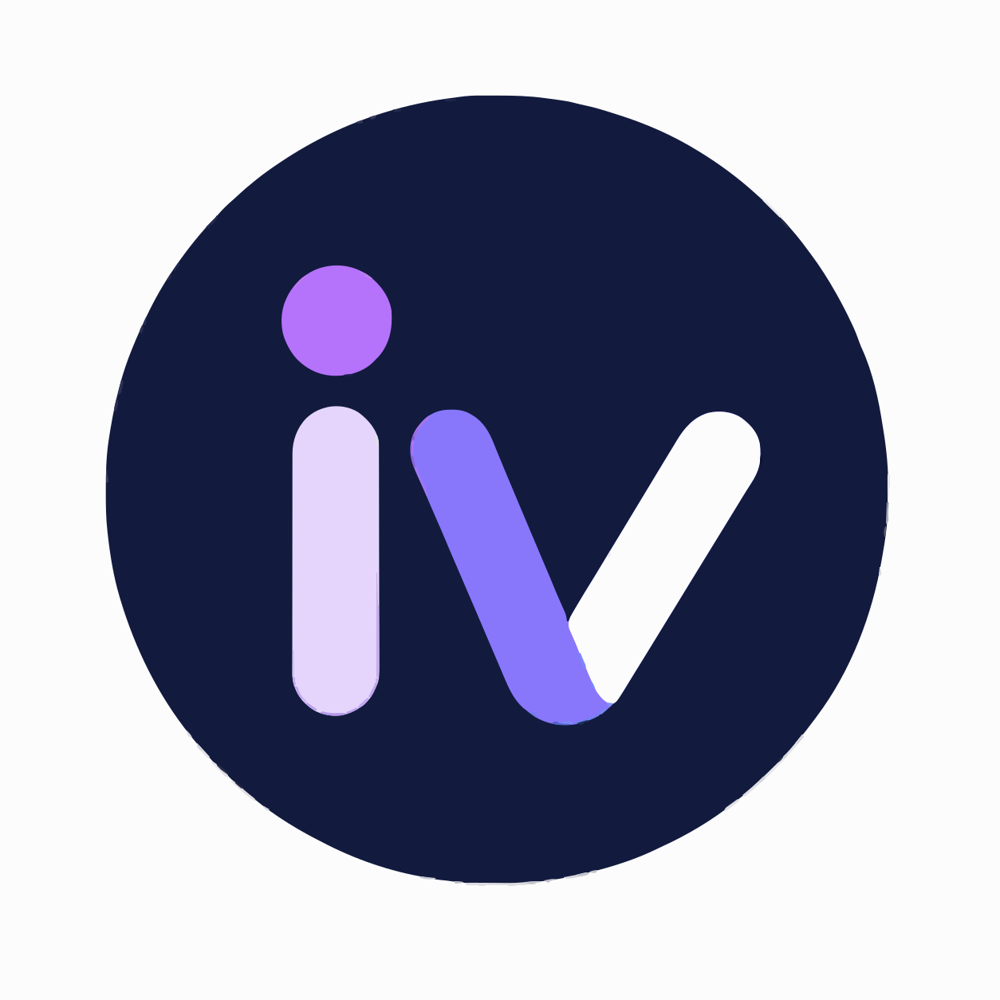

<div align="center">



# 🚀 InterVirta

### AI-Powered Interview Preparation Platform

Transform your resume into interview success using the power of **Google Gemini AI**.

Generate personalized interview questions, ATS-friendly resumes, skill gap analysis, compatibility scores, and a complete preparation roadmap—all in one place.

## 🌐 Live Demo

🚀 Frontend: Coming Soon
⚙ Backend API: Coming Soon


---


</div>

---

# ✨ Features

## 🤖 AI Interview Analysis

- Resume Parsing (PDF)
- Self Description Support
- Job Description Analysis
- AI Compatibility Score
- Skill Gap Detection

---

## 🎯 Interview Preparation

- 5 Personalized Technical Questions
- 5 Behavioral Questions
- Detailed Answer Guidance
- Interview Intent Explanation
- Personalized 7-Day Preparation Plan

---

## 📄 AI Resume Generator

Generate a professional ATS-friendly resume tailored specifically to the selected job description.

Features include:

- ATS Optimized
- Professional Layout
- HTML → PDF Generation
- Puppeteer Rendering
- Job Specific Resume Optimization

---

## 🔐 Authentication

- JWT Authentication
- Protected Routes
- Secure Login & Registration
- Persistent Sessions

---

## 📊 Dashboard

- Beautiful Modern Dashboard
- Recent Reports
- Match Scores
- Report History
- User Profile

---

# 🛠 Tech Stack

## Frontend

- React
- React Router
- Tailwind CSS
- Axios
- Context API

## Backend

- Node.js
- Express.js
- MongoDB
- Mongoose
- JWT Authentication
- Multer
- PDF Parse
- Puppeteer

## AI

- Google Gemini 2.5 Flash
- Structured JSON Generation
- AI Prompt Engineering

---

# ⚙️ Project Architecture

```
Frontend
│
├── Auth
├── Dashboard
├── Reports
├── Interview
├── Profile
└── Shared Components

Backend
│
├── Controllers
├── Services
├── Models
├── Routes
├── Middleware
├── AI
└── Database
```

---

# 📸 Screenshots

> Add screenshots here

```
Dashboard

Interview Report

Resume Generator

Reports

Profile
```

---

# 🚀 Getting Started

## Clone Repository

```bash
git clone https://github.com/chosen-one24/InterVirta.git
```

---

## Install Frontend

```bash
cd frontend
npm install
```

---

## Install Backend

```bash
cd backend
npm install
```

---

## Environment Variables

Create a `.env` file inside the backend.

```env
PORT=

MONGODB_URI=

JWT_SECRET=

GOOGLE_GENAI_API_KEY=
```

---

## Run Backend

```bash
npm run dev
```

---

## Run Frontend

```bash
npm run dev
```

---

# 🌟 Workflow

```
Resume / Self Description
            │
            ▼
Job Description
            │
            ▼
 Google Gemini AI
            │
 ├──────── Match Score
 ├──────── Skill Gaps
 ├──────── Technical Questions
 ├──────── Behavioral Questions
 ├──────── 7-Day Plan
 └──────── ATS Resume
            │
            ▼
Beautiful Dashboard
```

---

# 🎯 Future Improvements

- Email Interview Reports
- AI Mock Interviews
- Voice Based Interviews
- Company Specific Interview Sets
- Multiple Resume Templates
- Cover Letter Generator
- AI Career Suggestions

---

# 🤝 Contributing

Contributions, issues, and feature requests are welcome.

Feel free to fork the project and submit a pull request.

---

# 📜 License

This project is licensed under the MIT License.

---

<div align="center">

### ⭐ If you like this project, don't forget to star the repository!

Made with ❤️ using **MERN + Google Gemini AI**

</div>